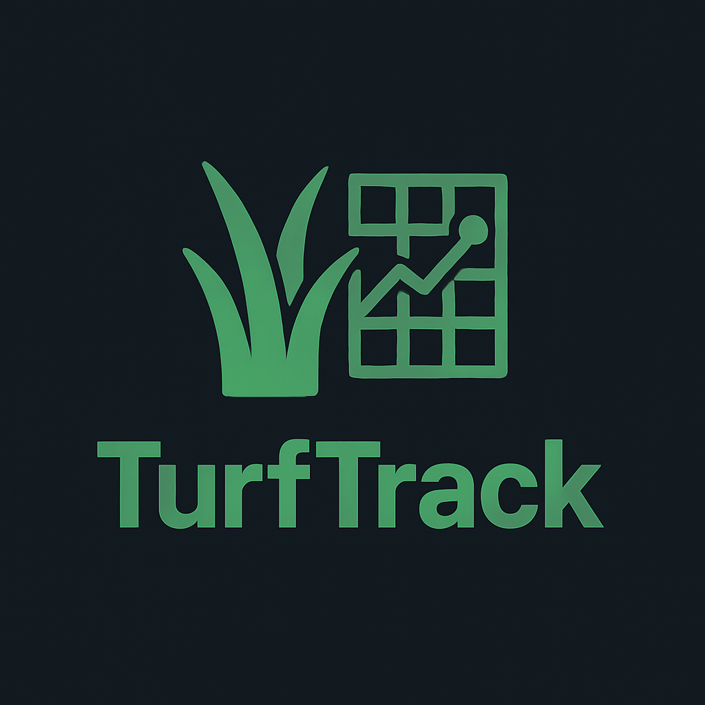
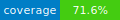
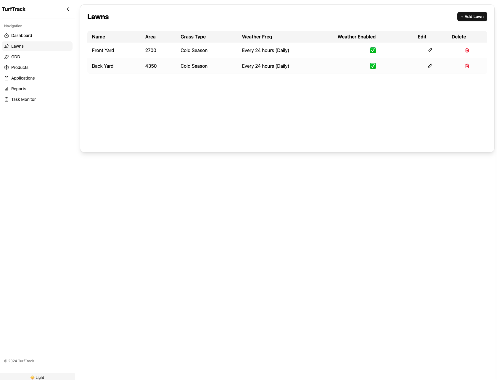
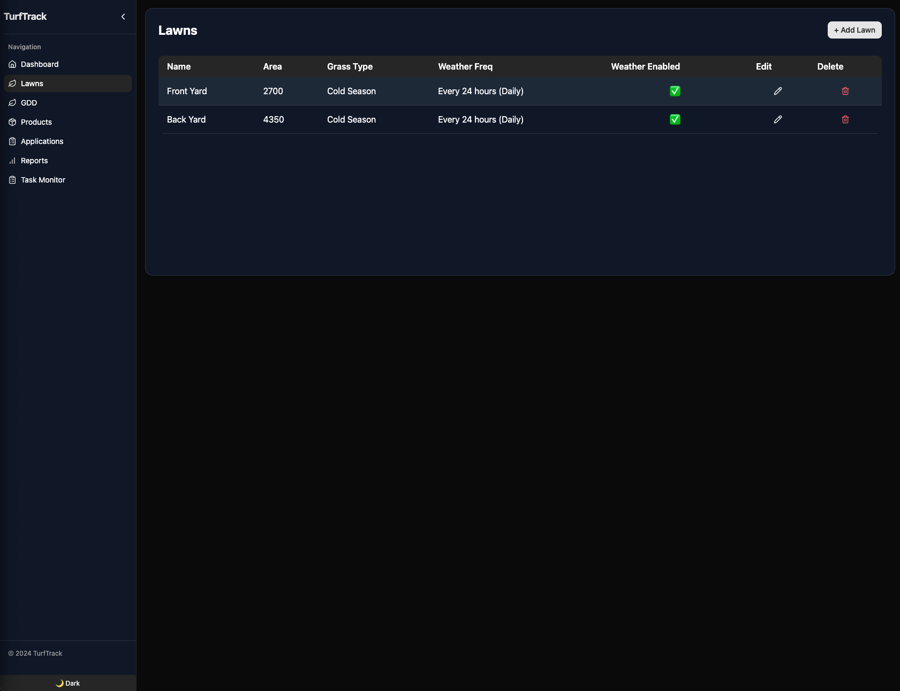
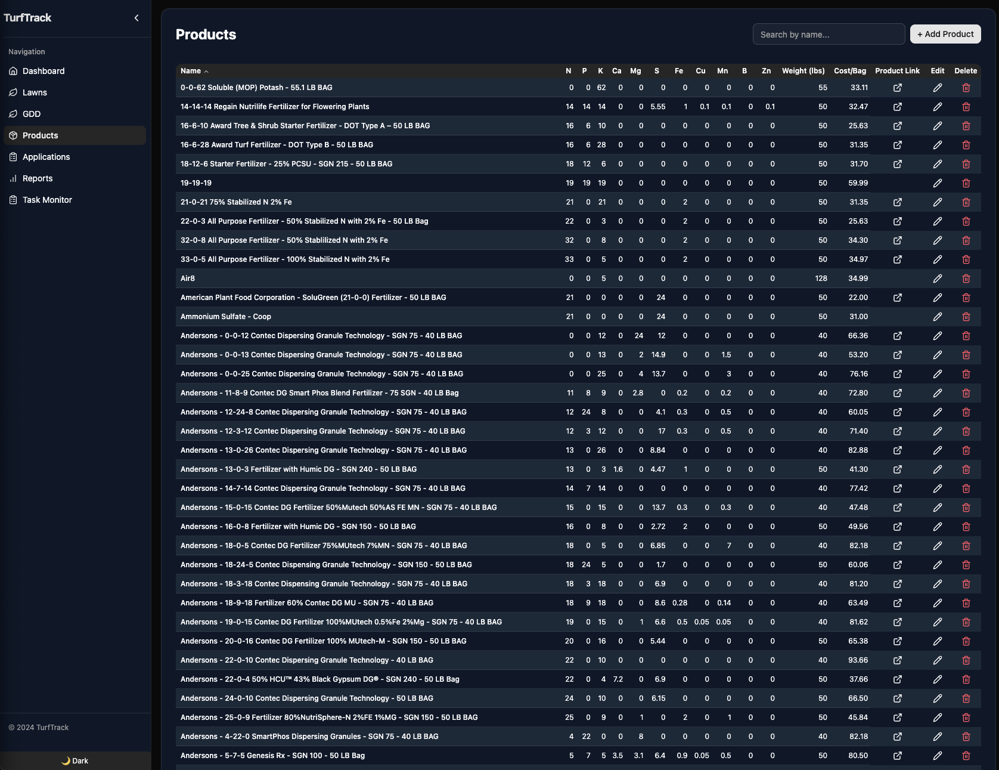
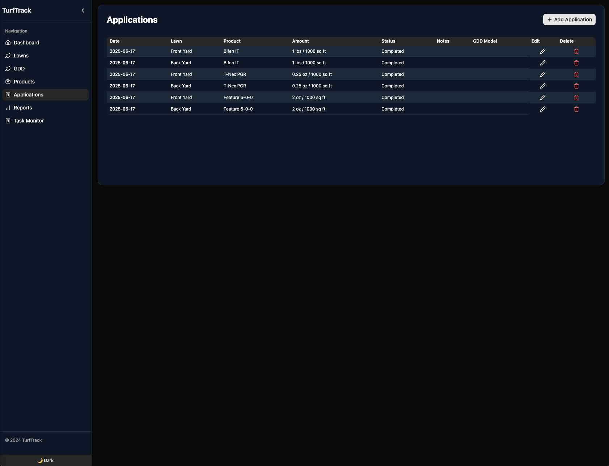
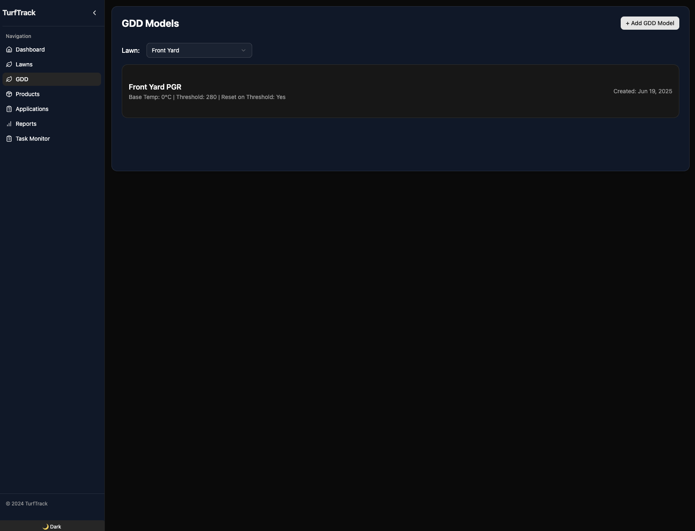
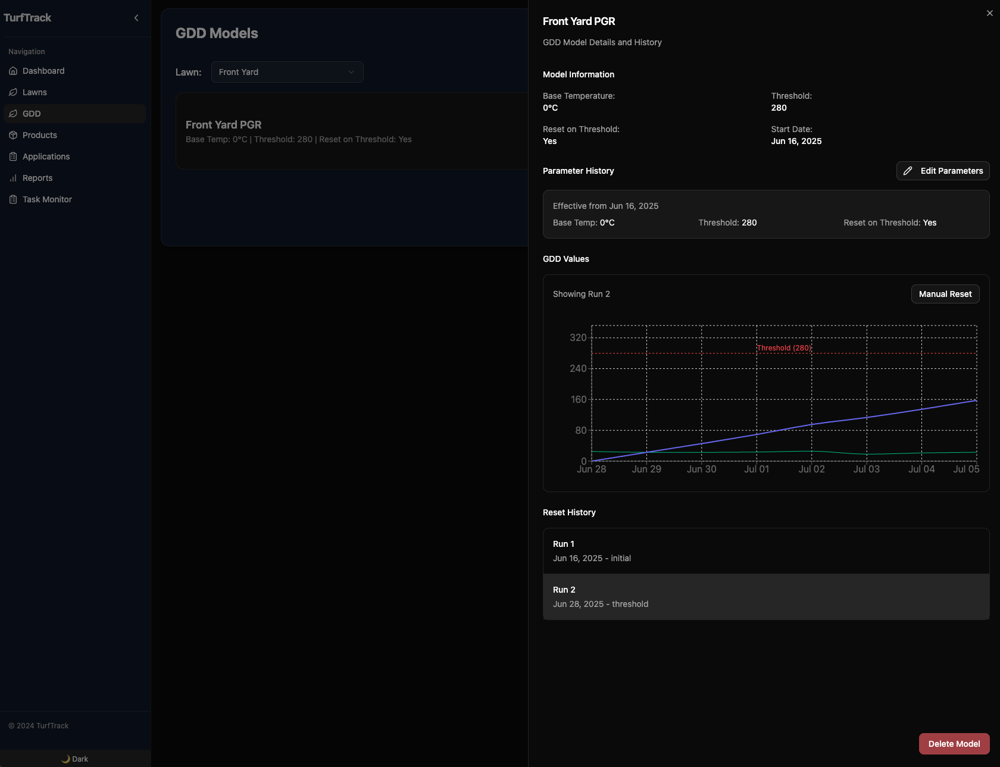
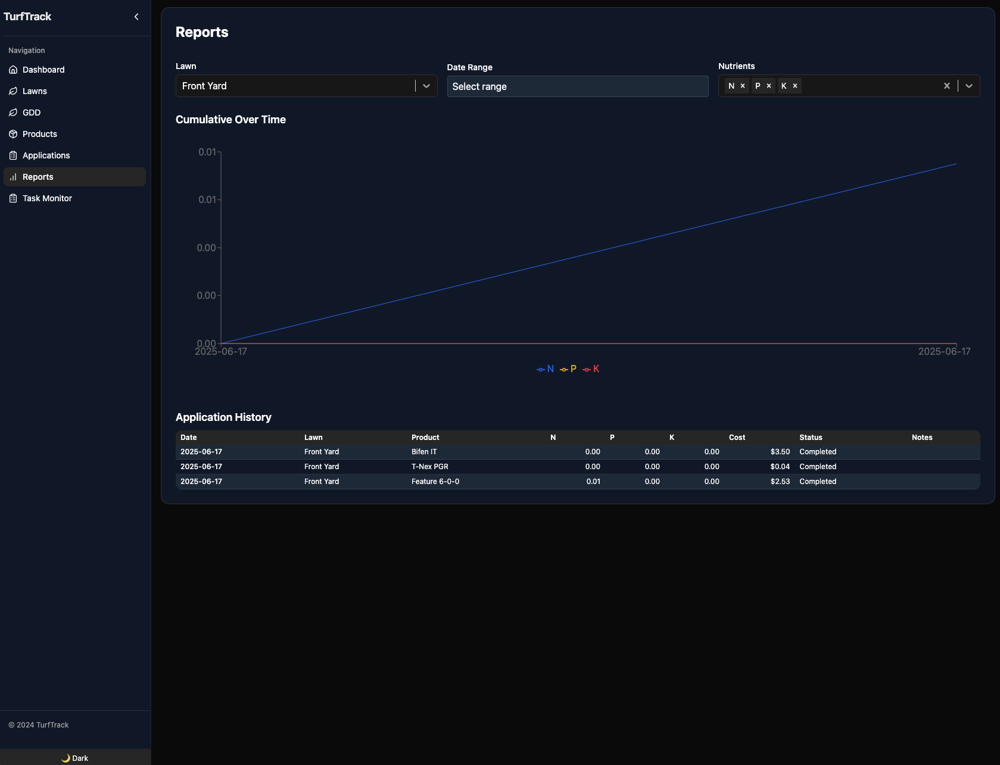
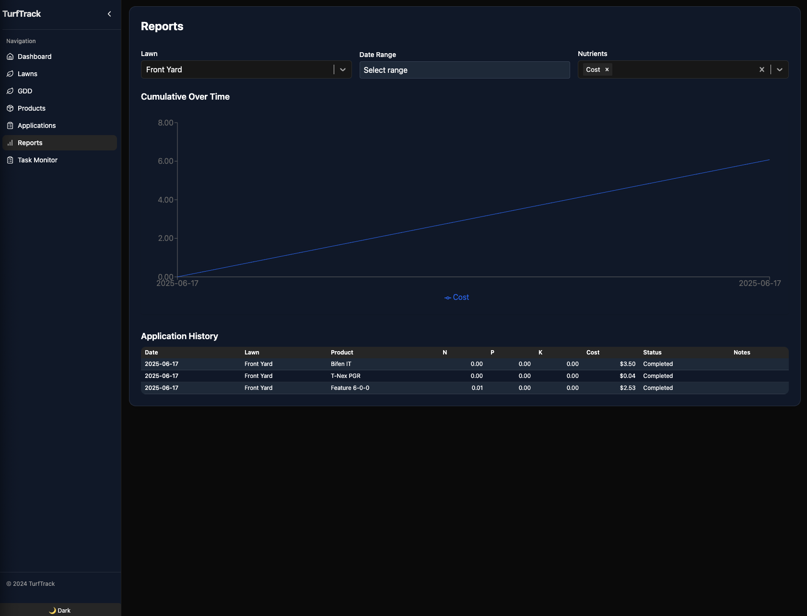

<p align="center">
  
</p>

# TurfTrack

[](https://github.com/RunOnYourOwn/TurfTrack/actions/workflows/ci.yml)


TurfTrack is a modern, full-stack application for managing turfgrass maintenance, weather data, growing degree day (GDD) models, and product applications.

---

## 🚀 Project Overview

- **Backend:** FastAPI (Python), SQLAlchemy, Celery, Redis, PostgreSQL
- **Frontend:** React (Vite, TypeScript), shadcn/ui, TanStack Query
- **Containerization:** Docker, Docker Compose
- **Testing:** Pytest, pytest-cov, factory-boy, httpx

TurfTrack provides:

- Weather data ingestion and deduplication
- GDD model management and analytics
- Product and application tracking
- Task monitoring and scheduling
- Modern, responsive UI

---

## 🏗️ Architecture Summary

- **Backend:** FastAPI REST API, async SQLAlchemy, Celery for background jobs, Redis for caching and task queue, PostgreSQL for persistent storage
- **Frontend:** Vite + React + TypeScript, shadcn/ui for UI components, TanStack Query for data fetching/caching
- **Deployment:** All services run in Docker containers as non-root users for security

---

## ✨ Screenshots

_Tell a visual story of your application. Add screenshots of the main features._

**Dashboard / Lawns Page**

<table>
  <tr>
    <td></td>
    <td></td>
  </tr>
</table>

**Products & Applications**

<table>
  <tr>
    <td></td>
    <td></td>
  </tr>
</table>

**GDD Tracking**

<table>
  <tr>
    <td></td>
    <td></td>
  </tr>
</table>

**Reports**

<table>
  <tr>
    <td></td>
    <td></td>
  </tr>
</table>

---

## ⚡ Quickstart

Getting TurfTrack running on your local machine is simple.

### Prerequisites

- [Docker](https://www.docker.com/) & Docker Compose

### 1. Clone the Repository

```bash
git clone https://github.com/RunOnYourOwn/TurfTrack.git
cd TurfTrack
```

### 2. Run the Application

This single command downloads the pre-built Docker images and starts all services.

```bash
docker compose -f docker-compose.standalone.yml up -d
```

The application will be available at [http://localhost:3000](http://localhost:3000).

---

## 🛠️ For Developers

If you want to contribute to the code, follow these steps.

### 1. Environment Setup

- Copy the example environment file:
  ```bash
  cp .env.example .env
  ```
- **(Optional)** Fill in any required values in `.env` if you are not using the default Docker setup.

### 2. Start the Development Environment

This command mounts your local source code into the containers and enables hot-reloading for both the frontend and backend.

```bash
docker compose -f docker-compose.yml -f docker-compose.dev.yml up --build -d
```

- Frontend (with hot-reloading): [http://localhost:5173](http://localhost:5173)
- Backend API Docs: [http://localhost:8000/docs](http://localhost:8000/docs)

---

## 🧪 Testing

To run the backend test suite:

```bash
cd backend
./run_tests.sh
```

## Container Images & Deployment

This project uses GitHub Actions to automatically build and publish versioned Docker images to the GitHub Container Registry (GHCR). See `docker-compose.standalone.yml` for an example of how to use them.

### Image Versioning

Three separate images are published: `turftrack-backend`, `turftrack-celery`, and `turftrack-frontend`. The following tagging strategy is used:

- `:latest`: For every push to the `main` branch, images are tagged with `:latest`. This tag represents the most recent development build.
- `:sha-xxxxxxx`: Every commit-specific image is tagged with its short git SHA (e.g., `:cb758e7`).
- `:<version>`: When a formal release is created, images are tagged with the corresponding semantic version number (e.g., `v1.2.3`).

### Creating a Release

To create a new, versioned release (for maintainers):

1.  Ensure all your changes are on the `main` branch.
2.  Use the `version.sh` script to bump the version number. For example, to create a patch release:
    ```bash
    ./scripts/version.sh release patch
    ```
3.  This will push a new version tag to GitHub, which triggers the `Release` workflow.
4.  The workflow will test, build, and publish the images, and create a draft release on GitHub.
5.  Go to the GitHub Releases page to review and publish the draft.

---

## 🤝 Contributing

This project is open to contributions! Here's how you can help:

- **Report Bugs:** If you find a bug, please [open an issue](https://github.com/RunOnYourOwn/TurfTrack/issues) and provide as much detail as possible.
- **Suggest Features:** Have an idea? [Start a discussion](https://github.com/RunOnYourOwn/TurfTrack/discussions) or create an issue with the `enhancement` label.
- **Submit Pull Requests:** We welcome PRs for bug fixes and new features. Please follow the development workflow below.

### Development Workflow

- Use feature branches and pull requests.
- Write unit tests for all new backend logic.
- Ensure your code is linted and formatted correctly.

---

## 🚢 Production & Deployment

- All containers run as non-root users for security
- Use Docker Compose for deployment
- Ensure `.env` is set with production values and not committed to version control
- See `docs/before_production.md` for a full checklist before going live

---

## 🤝 Contributing & Support

- See `docs/` for architecture, technical details, and tasks
- Open issues or pull requests for bugs, features, or questions
- Contact the maintainers via GitHub or your organization's preferred channel

---

## 📄 Documentation

- [Architecture Diagram](docs/architecture.mermaid)
- [Technical Specs](docs/technical.md)
- [Production Checklist](docs/before_production.md)
- [Task List](docs/tasks.md)
- [Status & Progress](docs/status.md)
