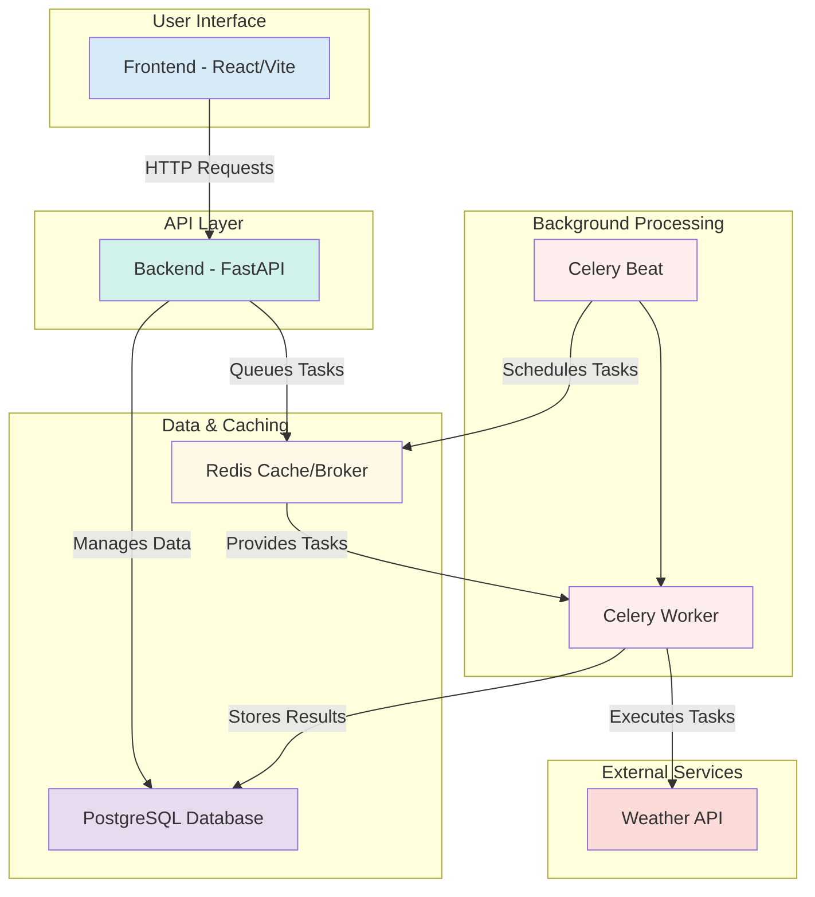

# System Architecture

Here is a diagram of the TurfTrack system architecture.

This diagram shows the flow of data and interactions between the major components of the application, from the user-facing frontend to the backend services and external data sources.

**Observability:**

- Centralized logging stack (Loki, Promtail, Grafana) collects logs from all containers/services.
- Request ID correlation enables end-to-end tracing of API requests and background tasks.
- All logs are searchable by request/task ID in Grafana for full-stack debugging and monitoring.
