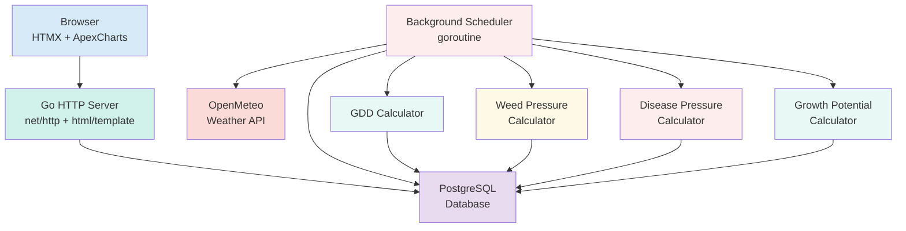

# System Architecture

## Overview

TurfTrack runs as a single Go binary with an embedded HTTP server and background scheduler. It replaces the previous Python/React/Celery stack with a simpler deployment model.



## System Components

### HTTP Server (Go net/http)

- **Server-rendered pages**: HTML templates with HTMX for interactive forms
- **JSON API endpoints**: Chart data for ApexCharts (weather, disease, GDD, growth potential, weed pressure, water)
- **CRUD handlers**: Form submissions for lawns, products, applications, GDD models, irrigation
- **Static file serving**: CSS, JS, images
- **Middleware**: Request logging, security headers

### Background Scheduler (goroutine)

- **Startup run**: Full 60-day weather fetch + all calculations
- **Daily recurring**: Configurable hour/timezone, 2-day optimized window
- **On-demand fetch**: Triggered when creating lawns/locations
- **Task status tracking**: Records success/failure in database
- **No external dependencies**: Replaces Celery + Redis + Beat

### Database (PostgreSQL)

- **SQL migrations**: Applied on startup via `internal/db`
- **Parameterized queries**: SQL injection prevention via `database/sql`
- **UPSERT operations**: Idempotent weather and calculation storage
- **CASCADE deletes**: Location deletion cleans up all related data
- **App settings table**: Runtime configuration for scheduler

### UI (DaisyUI + HTMX)

- **DaisyUI v5**: Component library on Tailwind CSS 4
- **HTMX**: Form submissions, partial page updates
- **ApexCharts**: Interactive charts for analytics
- **Responsive**: Collapsible sidebar + mobile bottom dock
- **Dark/Light themes**: Toggle with localStorage persistence

## Calculation Engines

All calculation logic lives in `internal/calc/` as pure functions with no database dependencies:

### GDD (Growing Degree Days)
- Daily: `GDD = ((Tmax + Tmin) / 2) - Base Temperature`
- Cumulative tracking with manual and threshold reset handling
- Multi-run support for tracking accumulation periods

### Disease Pressure (Smith-Kerns)
- Dollar spot prediction: `logit = b0 + b1*avg_temp + b2*avg_rh`
- 5-day moving averages for temperature and humidity
- Valid range: 10-35C

### Growth Potential
- Gaussian curve: `GP = exp(-0.5 * ((temp - t_opt) / sigma)^2)`
- Cool season: optimal 20C, sigma 5.5
- Warm season: optimal 31C, sigma 7.0
- 3/5/7-day rolling averages

### Weed Pressure
- 5-factor weighted model (max 10.0): GDD risk, soil temp, moisture, turf stress, seasonal timing
- Species-specific thresholds
- Year-to-date GDD accumulation

### Water Balance
- Weekly ET0 vs precipitation vs irrigation
- Deficit calculation with status (adequate/deficit/critical)

## Data Flow

1. **Weather ingestion**: Scheduler fetches OpenMeteo API -> upserts into `daily_weather`
2. **Cascade calculations**: Weather -> disease, growth potential, GDD, weed pressure, water summaries
3. **User interactions**: Browser -> HTMX form POST -> handler -> database -> redirect
4. **Chart data**: Browser -> JSON API GET -> handler queries DB -> JSON response -> ApexCharts renders

## Docker Deployment

```
Docker containers:
  - go-app: Single binary (HTTP server + scheduler)
  - postgres: PostgreSQL 16

Previous stack (removed):
  - backend (FastAPI + gunicorn)
  - frontend (Node.js / Vite)
  - redis (message queue)
  - celery-worker
  - celery-beat
```

## Security

- Non-root container execution
- Parameterized SQL queries (no string interpolation)
- Server-rendered HTML (no XSS via React auto-escaping equivalent)
- Security headers (X-Content-Type-Options, X-Frame-Options)
- Trivy image scanning in CI/CD
