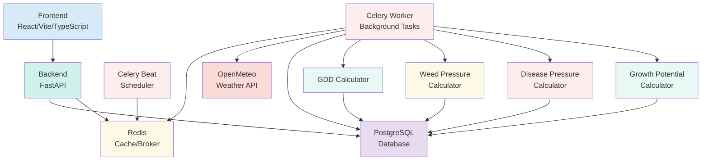

# System Architecture

Here is a diagram of the TurfTrack system architecture.

## System Components

### Frontend (React/Vite/TypeScript)

- **Dashboard**: Real-time analytics with GDD, weed pressure, disease pressure, and growth potential charts
- **Lawns Management**: CRUD operations for lawn tracking with location-based weather
- **Products Management**: Comprehensive product database with nutrient analysis
- **Applications Tracking**: Record and monitor product applications
- **GDD Models**: User-defined growing degree day models with reset handling
- **Task Monitor**: Real-time background task monitoring and management
- **Reports**: Historical data analysis and reporting

### Backend (FastAPI)

- **RESTful API**: Comprehensive endpoints for all data models
- **Async Support**: Full async/await support for high performance
- **Request Tracing**: End-to-end request ID correlation
- **Data Validation**: Pydantic schemas for all data models
- **Error Handling**: Comprehensive error handling and logging

### Background Processing (Celery)

- **Scheduled Tasks**: Daily weather updates, GDD recalculations
- **On-Demand Tasks**: Manual backfills, recalculations
- **Task Monitoring**: Real-time task status tracking
- **Error Recovery**: Automatic retries and error handling

### Database (PostgreSQL)

- **Relational Design**: Normalized schema with proper relationships
- **Performance**: Optimized indexes for date range queries
- **Data Integrity**: Foreign key constraints and cascading deletes
- **Audit Trail**: Created/updated timestamps on all records

### Caching (Redis)

- **Task Broker**: Celery task queue management
- **Session Storage**: User session management
- **Data Caching**: Frequently accessed data caching

## Calculation Engines

### GDD (Growing Degree Days)

- **Daily Calculation**: `GDD = ((Tmax + Tmin) / 2) - Base Temperature`
- **Cumulative Tracking**: Accumulated GDD with reset handling
- **Run Management**: Multiple GDD accumulation periods
- **Forecast Integration**: Future GDD predictions

### Weed Pressure

- **Multi-Factor Model**: 5 environmental factors weighted scoring
- **Species Specific**: Different thresholds for each weed species
- **Seasonal Timing**: Emergence season considerations
- **Real-time Updates**: Automatic calculation on weather changes

### Disease Pressure

- **Smith-Kerns Model**: Scientific dollar spot prediction model
- **Moving Averages**: 5-day temperature and humidity averages
- **Risk Scoring**: Probability-based risk assessment
- **Forecast Integration**: Future disease pressure predictions

### Growth Potential

- **Temperature Based**: Optimal temperature curves for grass types
- **Grass Specific**: Different curves for warm/cool season grasses
- **Rolling Averages**: 3, 5, and 7-day smoothing
- **Real-time Updates**: Automatic calculation on weather changes

## Data Flow

1. **Weather Data Ingestion**: OpenMeteo API → PostgreSQL (deduplicated by location)
2. **Calculation Triggers**: Weather updates → Automatic recalculation of all models
3. **User Interactions**: Frontend → API → Database → Background tasks
4. **Task Monitoring**: Celery tasks → Task status tracking → Frontend display
5. **Data Analytics**: Historical data → Calculation engines → Charts and reports

## Observability

- **Centralized Logging**: Loki, Promtail, Grafana stack
- **Request Tracing**: End-to-end request ID correlation
- **Task Monitoring**: Real-time Celery task status
- **Performance Metrics**: API response times and calculation durations
- **Error Tracking**: Comprehensive error logging and alerting

## Security

- **Non-Root Containers**: All services run as non-root users
- **Input Validation**: Comprehensive data validation at API layer
- **Rate Limiting**: API rate limiting for external services
- **Data Sanitization**: Input sanitization and SQL injection prevention
